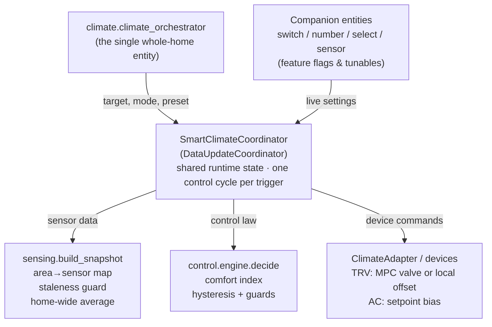
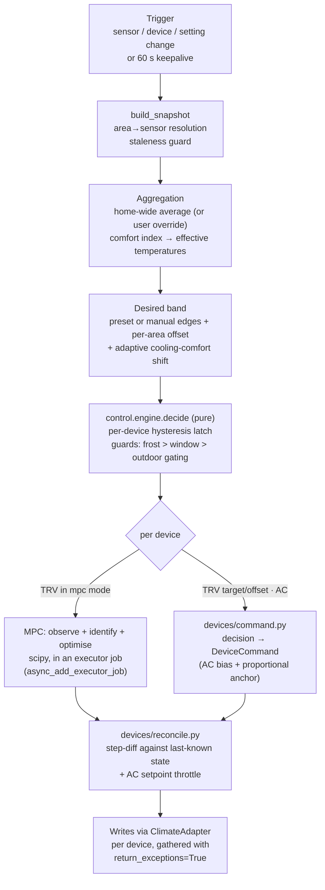

# Architecture

Climate Orchestrator exposes a **single, whole-home smart climate entity** that
orchestrates every radiator valve (TRV) and air conditioner in the house. It
picks the right device(s) to run based on per-area sensors *and* a home-wide
average, coordinates heating against cooling so they never fight, uses humidity
for comfort, and drives TRVs with a Model Predictive Controller. It is built
test-first with modern tooling.

- **Domain:** `climate_orchestrator`
- **Target Home Assistant:** 2024.12+ (matching current
  `pytest-homeassistant-custom-component` support)

## Target hardware

The integration is built around two classes of `climate` device, distinguished
by *how* each can be steered:

| Class | Representative devices | Control levers |
|-------|------------------------|----------------|
| **Radiator valve (TRV)** | Zigbee thermostatic valves such as the SONOFF TRVZB (via Zigbee2MQTT) | valve opening % (0–100), `local_temperature_calibration`, and a normal setpoint |
| **Air conditioner** | mini-split / window / portable units (e.g. Midea-class) | setpoint, mode, fan, swing — **setpoint-only**, no sensor-offset lever |

Design implication: TRVs support *both* valve control and sensor-offset
calibration; an AC supports *neither* — only setpoint, mode, fan, swing. The
device abstraction accommodates both control philosophies (see
[Device control](device-control.md)). Any HA `climate` entity in these classes
works: the adapter reads each device's reported capabilities (heat/cool/dry,
setpoint range and step) at runtime and drives only what it actually supports.

## High-level architecture



**Why a coordinator.** A single `DataUpdateCoordinator`
(`SmartClimateCoordinator`) owns the shared runtime state (current sensor
readings, aggregates, learned MPC state, feature-flag values) and runs one
control cycle per trigger. All entities (the climate entity, switches, numbers,
sensors) read from the coordinator. This keeps the `ClimateEntity` thin —
no god-object entity — and pushes the logic into
testable, dependency-light modules (the pure `control/` package, the `sensing/`
snapshot builder, and per-TRV `MpcController`s), with all device I/O behind a
`ClimateAdapter`.

**Control cycle triggers.** A control cycle runs on: any subscribed sensor
change, any managed-device state change, target/preset/mode change, a
feature-flag entity change, and a periodic keepalive
(`UPDATE_INTERVAL_SECONDS`, default 60 s, to re-assert offsets and run MPC).

### One control cycle



The scipy hop matters: system identification and optimisation are synchronous
numerical code, so the coordinator runs the MPC math in an executor job
(`hass.async_add_executor_job`), keeping the event loop unblocked. Each TRV has
its own controller, so concurrent jobs never share state.

## Repository layout

```
climate_orchestrator/
├── custom_components/
│   └── climate_orchestrator/
│       ├── __init__.py            # setup, coordinator wiring, platform forwarding, services
│       ├── manifest.json
│       ├── const.py               # domain, defaults, presets, tuning constants
│       ├── models.py              # SmartClimateData, DeviceReading, Band, Status (pure value objects)
│       ├── config_flow.py         # config + options flow (TRVs/ACs, outdoor sensor, weather entity, hints)
│       ├── brand/                 # in-integration icon.png/icon@2x.png (HA >= 2026.3 local brands)
│       ├── coordinator.py         # SmartClimateCoordinator: snapshot + control cycle + persistence
│       ├── settings.py            # NumberSetting/SwitchSetting registries + RuntimeSettings resolver
│       ├── entity.py              # shared base entity + hub DeviceInfo
│       ├── diagnostics.py         # downloadable diagnostics dump
│       ├── control/
│       │   ├── engine.py          # arbitration: guards + capability gating + per-area offset (pure)
│       │   ├── hysteresis.py      # OR-engage / AND-release demand law (pure)
│       │   ├── comfort.py         # apparent temperature + dew point (pure)
│       │   ├── adaptive_comfort.py# running-mean outdoor + saturating cool-edge relaxation (pure)
│       │   ├── adaptive_bias.py   # self-tuning AC setpoint bias (integral feedback) (pure)
│       │   ├── window.py          # window-open suppression + grace debounce (pure)
│       │   ├── slope.py           # least-squares home temperature slope (pure)
│       │   ├── throttle.py        # AC setpoint write throttling (pure)
│       │   ├── forecast.py        # hourly→per-step forecast expansion for preconditioning (pure)
│       │   ├── numeric.py         # shared clamp() helper (pure)
│       │   ├── runtime_stats.py   # runtime-fraction + cycles/hour integrals (pure)
│       │   └── mpc/
│       │       ├── model.py       # first-order thermal model + system ID (scipy)
│       │       ├── observer.py    # Kalman state estimate
│       │       ├── optimizer.py   # receding-horizon valve solve; scalar or forecast series (scipy)
│       │       └── controller.py  # stateful per-room MPC (observe + optimise + persist)
│       ├── sensing/
│       │   ├── registry.py        # area matching, snapshot build, staleness guard
│       │   └── aggregate.py       # mean-or-none / slope helpers (pure)
│       ├── devices/
│       │   ├── adapter.py         # ClimateAdapter: capabilities + read/apply over HA climate services
│       │   ├── model.py           # DeviceCommand / Mode / AdapterCapabilities (pure)
│       │   ├── command.py         # decision → device command (pure)
│       │   ├── reconcile.py       # step-diff command minimisation (pure)
│       │   └── trv.py             # TRV number discovery + local-offset helpers
│       ├── climate.py             # the single whole-home ClimateEntity
│       ├── sensor.py / binary_sensor.py / switch.py / number.py / select.py
│       ├── icons.json / strings.json
│       └── translations/en.json
├── tests/                         # unit/ (mirrors the package) + ha/ (hass fixtures)
├── pyproject.toml                 # uv-managed, ruff + mypy + pytest config
├── .github/workflows/ci.yml       # ruff, mypy, pytest+coverage, hassfest, HACS (GitHub Actions)
├── .github/workflows/release.yml  # python-semantic-release on green CI
├── hacs.json
├── CHANGELOG.md
└── README.md
```

Next: [Sensing](sensing.md) — how each device's readings and the home-wide
average are built.
