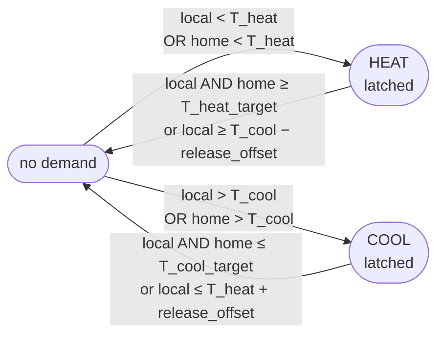

# Control model

The control law is built from pure, separately tested functions: a two-setpoint
band, an asymmetric latched hysteresis, a humidity-aware comfort index, a
heat/cool arbiter, and a set of layered guards.

## Two setpoints: the heating/cooling band

The whole-home entity is a `heat_cool` climate that exposes **two setpoints**
via `TARGET_TEMPERATURE_RANGE`: a low handle = **heating edge** `T_heat` and a
high handle = **cooling edge** `T_cool`. Together they define the band:

- **Heat** when measured `< T_heat`; **cool** when measured `> T_cool`.
- **Neutral zone:** `T_heat ≤ measured ≤ T_cool` → no actuation. The gap
  between the edges structurally prevents simultaneous heat+cool demand.
- The hysteresis "target" `T` (the release reference below) is the band
  midpoint `(T_heat + T_cool) / 2`.

Presets set both edges (see [Presets](#presets)); a manual `set_temperature`
sets the two handles directly. (Earlier drafts used a single target + a
`deadband` number to derive the edges; the two-setpoint model supersedes it and
the `deadband` entity was removed.)

## Asymmetric latched hysteresis (the core trigger law)

For each managed device, let `x_local` be its area value and `x_home` the home
average, both as **comfort-adjusted** temperatures (next section). Define the
control targets, each capped at the midpoint `T` so they can't cross:

```
T_cool_target = max(T_cool − tolerance, T)
T_heat_target = min(T_heat + tolerance, T)
```

**Cooling demand for a device:**

```
ENGAGE  when  x_local > T_cool  OR  x_home > T_cool
STAY ON until (x_local ≤ T_cool_target  AND  x_home ≤ T_cool_target)
        OR    x_local ≤ T_heat + release_offset         # opposite-edge early-out
```

**Heating demand (mirror):**

```
ENGAGE  when  x_local < T_heat  OR  x_home < T_heat
STAY ON until (x_local ≥ T_heat_target  AND  x_home ≥ T_heat_target)
        OR    x_local ≥ T_cool − release_offset
```

As a per-device state machine:



Properties of this law (`control/hysteresis.py`, pure):

- A device **engages at the trigger edge** and drives to `edge ± tolerance`
  (the control target), so rooms settle just inside the comfort edge (the
  efficient end of the band) rather than at the midpoint. The same setpoint is
  what's commanded to the device (see
  [Device control](device-control.md)).
- `tolerance` is a configurable `number` entity (default 0.3 K). The
  engage-at-edge / release-past-edge gap *is* the anti-short-cycle hysteresis,
  so jitter at an edge can't toggle a device and a minimum on/off gap holds
  even for a narrow band. Capping the targets at the midpoint keeps heat/cool
  from fighting.
- `release_offset` is a configurable `number` entity (default 0.5 K): a
  secondary early-out that stops cooling once a room has dropped near the
  heating regime (and vice-versa), preventing a device from dragging its room
  across the neutral zone.
- The OR-to-engage / AND-to-release asymmetry makes the system eager to respond
  to a hot/cold room or a hot/cold house, but conservative to disengage — which
  suppresses short-cycling. (The `home_average_trigger` switch, default on, can
  disable the home-average side entirely so each room engages/releases on its
  own reading only.)
- Per-device demand state is latched in coordinator state so hysteresis
  survives cycles. All of a device's mutable bookkeeping — the demand latch,
  last command, AC-setpoint throttle state, MPC controller, last valve
  fraction, bias integral, and runtime samples — lives on a single per-device
  `DeviceRuntime` object (`coordinator.py`), so init and cleanup are atomic.

### Per-area band offset

One **per-area band offset** number (`area_offset_<area_id>`, °C, range
±`AREA_BAND_OFFSET_LIMIT`) is created for each area that contains a managed
device. A positive offset shifts that area's whole band up — the room runs
warmer (heats sooner, releases later); negative runs it cooler. It's applied in
the engine by subtracting the offset from the area's *local* effective reading
only (clamped to `[MIN_TEMP, MAX_TEMP]`), never the home average — so it biases
just that room without distorting the whole-home OR-trigger.

## Comfort index (humidity use)

Control runs off a **feels-like** temperature rather than raw dry-bulb, when
humidity is available:

- **Formula — Apparent Temperature (AT).** The Australian Bureau of Meteorology
  AT: `AT = T + 0.33·e − 0.70·ws − 4.00`, where `e` is water-vapour pressure
  from `T` and RH and `ws` is wind speed (0 indoors → `AT = T + 0.33·e − 4.00`).
  Unlike the US Heat Index it's a single continuous function across the whole
  indoor range, covering both heating and cooling with no branching. Higher
  humidity pushes AT up (cool earlier / longer); the humidity contribution is
  small at low temperatures, so heating stays near dry-bulb. It is used on the
  *actual* RH (no rebaselining) — that matches how a person experiences the
  room.
- Because AT can differ noticeably from the dry-bulb number a user sets, the
  whole-home AT is **surfaced as its own sensor**
  (`home_feels_like_temperature`) next to the plain average, so it's visible
  *why* the thermostat is running when the dry-bulb reading looks fine.
- Implementation (`control/comfort.py`, pure): `vapour_pressure`,
  `apparent_temperature`, `dew_point`, and `effective_temperature`.
  `effective_temperature` **blends dry-bulb toward AT by a configurable
  influence**: `effective = T + k·(AT − T)`, where `k` is the
  `comfort_humidity_influence` number (default 1.0 → full AT; `0` → dry-bulb,
  i.e. humidity ignored; `>1` amplifies). It returns dry-bulb when comfort is
  off or humidity is missing. `effective_temperature` feeds `x_local`/`x_home`
  in the trigger law (the engine threads `k` via
  `GlobalInput.comfort_influence`); the `home_feels_like_temperature` sensor
  and the climate entity's `current_temperature` use the same blended value, so
  the displayed feels-like always matches what control judges against. A
  `switch` (`comfort_index_targeting`) disables comfort targeting and falls
  back to dry-bulb.

### Adaptive cooling comfort (opt-in)

An optional, *cooling-only* relaxation of the cool edge driven by the outdoor
temperature. A running-mean outdoor temperature (exponential smoother, ~1-day
time constant, persisted) is compared against an **onset** = `cool_edge + bias`
(`adaptive_cooling_comfort_onset_bias`, default +1 K). The cool edge then rises
by a smooth **saturating** amount of the outdoor *excess* over that onset,
capped at `adaptive_cooling_comfort_max_shift` (default 2 K):

```
excess     = max(0, RMOT − (cool_edge + bias))
cool_shift = max_shift · (1 − exp(−excess / response))
adaptive_cool = cool_edge + cool_shift
```

`adaptive_cooling_comfort_response` (default 5 K) is the characteristic degrees
of excess for ~63% of the cap, so a larger value gives a gentler ramp; the
curve starts at zero at the onset, rises with an ever-decreasing slope, and
asymptotically approaches (never reaches) the cap — no jump, no hard plateau.
The **heat edge is never touched**, so a device is never driven harder than the
preset, and nothing shifts when it's milder outside than the onset.

This replaced an earlier EN 16798 neutral-referenced model whose warm-leaning
neutral (≈24.4 °C at `T_rm`=17) raised the cool edge even at mild outdoor
temperatures — exactly the behaviour we wanted gone (relaxing cooling only when
it's genuinely hot out). Pure functions in `control/adaptive_comfort.py`. The
shifted band is *always computed* (surfaced via the `adaptive_cool_setpoint`
sensor for preview — there's no heat-setpoint sensor since the heat edge never
moves) but only *applied* to control when the `adaptive_cooling_comfort` switch
is on. `running_mean_outdoor_temperature` is exposed as a diagnostic sensor.

### Dew-point guard (safety trigger)

Independently of the temperature band, if the area dew point exceeds a
configurable threshold (`number`, default 16 °C), the guard can (a) request the
AC `dry` mode and/or (b) flag a binary sensor for automations. Pure function
`dew_point(temp_c, rh_pct)`; a toggle entity enables/disables it.

## Heat/cool coordination

A single arbiter (`control/engine.py`) decides the whole-home `hvac_action`
each cycle:

1. Compute per-device heating and cooling demand via the trigger law above.
2. Global guards in priority order: **window-open** (suppress the affected
   area — detected automatically from `window`/`door`/`opening`/`garage_door`
   `binary_sensor`s in the device's area, after an optional grace delay; see
   below; **coolers can be exempted** via `ac_ignore_window` for a
   portable/exhaust-hose split that needs its window open to vent — heaters are
   never exempted), **frost protection** (force heating if any area below frost
   temp, overrides everything), **AC drain protection** (cooler-only — hold the
   AC off, cooling *and* dry-mode, once the configured condensate drain / tank-
   full sensor has been on for the grace window; reason `drain_full`),
   **outdoor-temp gating** (next section).
3. Mutual exclusion: a device cannot heat and cool simultaneously; the neutral
   deadband normally guarantees this, and the arbiter asserts it as an
   invariant (unit-tested).
4. Build each device's command (`devices/command.py`) and dispatch it through
   that device's `ClimateAdapter`.

**AC heating assist.** Radiators own heating by default. If the
`ac_heating_assist` toggle is on and an AC supports `heat`, the arbiter may
also command that AC to heat — configurable as *supplement* (engage when an
area's heating demand persists and its radiators are saturated) or *substitute*
(areas with an AC but weak/no TRV coverage). Still bound by the single-target
band and the heat/cool mutual-exclusion invariant.

## Outdoor-temp gating

Outdoor temperature comes from a **user-selected outdoor sensor** (e.g. simply
point this at the AC's outdoor-temperature sensor), with an optional
**weather-entity forecast** as the only fallback. Behaviour (toggle entity):

- Suppress **heating** when outdoor ≥ `heat_off_outdoor` threshold.
- Suppress **cooling** when outdoor ≤ `cool_off_outdoor` threshold.

Gating is symmetric by design: both the heating and the cooling path are
outdoor-aware.

## Window-open grace delay

The window-open guard is debounced by a configurable **Window open delay**
(`number`, minutes; default `0` = stop immediately). When an area's window
opens, the window monitor records the open timestamp; the guard only
suppresses
that area's heating/cooling once the window has stayed open for at least the
delay, so a brief airing doesn't interrupt an in-progress heat-up.

The rule itself is a pure predicate (`control/window.py`,
`window_suppresses(raw_open, opened_at, now, delay)`), which keeps it
trivially unit-testable; the stateful side — per-area open timestamps, their
eviction when areas change, and the recheck timer — lives in `windows.py`'s
`WindowMonitor`. To avoid waiting for the next keepalive, opening a window
schedules a one-shot `async_call_later` refresh that re-runs control right
when the delay elapses (one timer, earliest deadline wins). Frost protection
still overrides an open window regardless of this delay.

## Presets

Presets are first-class and persisted. The active comfort **band is defined
directly by its two edges** — heat below the lower edge, cool above the upper
edge, neutral between:

| Field | Meaning                                      | Exposed as                                      |
| ----- | -------------------------------------------- | ----------------------------------------------- |
| `min` | lower band edge — heat when measured < `min` | `number.climate_orchestrator_preset_<name>_min` |
| `max` | upper band edge — cool when measured > `max` | `number.climate_orchestrator_preset_<name>_max` |

So `min`/`max` *are* the heating and cooling thresholds; the
single-target+deadband form is just the manual equivalent (`min = T − d`,
`max = T + d`).

**Default presets:** `Away`, `Home`, `Sleep` (edge values configurable).
Selecting a preset applies its edges; a manual temperature set on the climate
entity switches to a "manual" band derived from the single target + deadband
and remembers the last preset. All preset edges are `number` entities that
persist across restarts (RestoreEntity / coordinator store).

The offering is narrowed by the **Presets** multi-select in the config/options
flow: only selected presets appear in `preset_modes` and get setpoint numbers
(deselected presets' registry entries are pruned at setup), `manual` is always
last. Restoring (or defaulting to) a preset that is no longer selected falls
back to `home`, else `manual`.

### Boost

`boost` is an override preset, not a stored band: while active,
`_base_band_edges` derives the band from the *previous* preset's edges with
the demanded edge pushed by the **Boost offset** number. The direction is
resolved once at activation (single-purpose setups can only go one way;
heat_cool picks the side of the band midpoint the home average sits on) and
held, so a heat boost can't flip into cooling as the room warms past the
midpoint. A timer (`async_call_later`, **Boost duration**) reverts to the
previous preset; the deadline rides in the entity's `boost_until` attribute,
which RestoreEntity replays so a restart mid-boost re-arms the remaining time
(or reverts immediately when it expired while down). Everything downstream —
engine, guards, MPC, AC drive — sees only the boosted band; the adaptive
cooling-comfort shift is skipped during a boost.

### What the climate entity displays vs. controls

To keep the thermostat card consistent with the control loop, the entity shows
what control actually uses: `current_temperature` is the feels-like (apparent)
temperature whenever `comfort_index_targeting` is on (else dry-bulb), and
`target_temperature_high` is the adaptive-comfort-relaxed cool edge whenever
`adaptive_cooling_comfort` is on (`target_temperature_low`/heat edge is never
shifted). The *underlying* values are always carried as state attributes —
`dry_bulb_temperature` (raw home average) and `base_target_temp_low` /
`base_target_temp_high` (the user-set band).

!!! warning "Reading the base band back"

    The coordinator's `_desired()` reads the **base** band back from those
    attributes, not from `target_temp_high`; otherwise the displayed
    (already-shifted) cool edge would be re-shifted every cycle into a runaway.
    Setting a temperature stores the *base* band, so dragging the cool handle
    while a shift is active makes it re-snap to `new base + current shift`.

Next: [MPC](mpc.md) — the model-predictive valve controller behind `mpc` mode.
