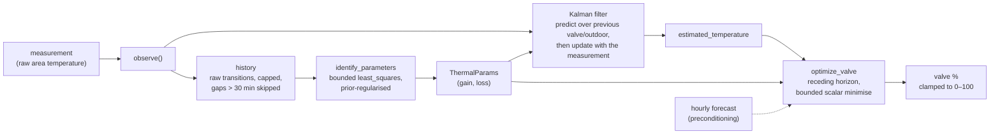

# Model Predictive Control

In `mpc` calibration mode, each TRV is driven by a per-room Model Predictive
Controller that learns the room's thermal behaviour and computes a **valve
opening %** directly. Every numerical piece is a **pure, separately unit-tested
function** fed synthetic thermal simulations, so the controller is testable
without hardware.

**Dependency:** `scipy`, declared in `manifest.json` `requirements`. A heavier
wheel but justified; this is the single biggest quality lever. `numpy` is
already present in HA core. (`do-mpc`/`cvxpy` were considered and rejected for
v1 as too heavy.) scipy is synchronous, so the coordinator runs the MPC
observe/identify/optimise math in an **executor job**
(`hass.async_add_executor_job`), keeping the event loop unblocked; each TRV has
its own controller, so concurrent jobs never share state.

One cycle of the learning loop, end to end:



## Thermal model

Room dynamics are modelled as linear first-order (single RC node):

```
dT/dt = gain·u − loss·(T − outdoor)
```

with `u` ∈ [0, 1] the valve fraction. Discretised
(`control/mpc/model.py: predict_step`):

```
T[n+1] = T[n] + dt · (gain·valve − loss·(T[n] − outdoor))
```

The model has no solar or supply-temperature term: `gain` is a single learned
constant (see [the constant-supply-temperature assumption](#assumption-constant-supply-temperature) below).

- `gain` — K per minute at full valve (how fast a fully-open valve heats the
  room).
- `loss` — 1/minute coupling to the outdoor delta (how fast the room leaks
  heat).

### Assumption: constant supply temperature

`gain` is a single learned constant, so the model assumes a fixed heat output
at a given valve opening. That holds for a radiator fed at a steady water
temperature (a fixed-flow boiler, electric). It does **not** hold for a
**weather-compensated** hydronic system — district heating, or a condensing
boiler on an outdoor-reset curve — where the supply temperature rises as it
gets colder, so the same opening emits more heat in harsh weather.

The model captures the *loss* side of harsh weather (`loss·(room − outdoor)`
grows with the gradient) but not the *output* side. Because the fit runs over a
rolling window it tracks a slowly-drifting supply temperature, and because
control is closed-loop the room still reaches target — but the model is
mis-specified: the fitter partly absorbs the weather-dependent emission into a
distorted `loss`, the residual error (`model_error`) runs higher,
preconditioning is less reliable, and a fast supply-temperature swing causes
transient over/undershoot until the fit catches up. The
[poor-fit repair](../reference/troubleshooting.md#repairs) surfaces a TRV whose
model can't fit, and on such systems `offset` mode (which defers modulation to
the valve's own loop) is usually the better choice. The proper fix —
modelling emission as `k·valve·(supply − room)` given a supply-temperature
sensor — is recorded as future work in
[ADR-0004](../decisions/0004-trv-calibration-mpc.md).

## System identification

System identification replaces ad-hoc EMA inference with
`scipy.optimize.least_squares` fitting `(gain, loss)` over a rolling window of
`(t, T, u, T_out)` transition samples, with bounds and L2 regularisation toward
priors (`identify_parameters` in `control/mpc/model.py`). It produces parameter
estimates plus residual diagnostics.

- **Prior regularisation.** The residual vector appends
  `_PRIOR_WEIGHT · (gain − prior.gain)` and `_PRIOR_WEIGHT · (loss − prior.loss)`
  to the prediction residuals, so a cold start (or degenerate data) stays near
  the safe priors (`DEFAULT_GAIN`, `DEFAULT_LOSS`). With fewer than
  `MIN_SAMPLES` (6) transitions, the prior is returned unchanged.
- **Physical bounds.** The fit runs inside `bounds=([0, 0], [MAX_GAIN,
  MAX_LOSS])` — `MAX_GAIN` = 2.0 K/min at full valve, `MAX_LOSS` = 1.0 /min. A
  radiator gaining 2 K/min or a room with a 1-minute thermal time constant is
  already absurd; anything the solver pushes past these is degenerate data, not
  physics. Finite bounds also keep the optimiser's rollout from overflowing on
  runaway parameters. The starting point `x0` is clamped inside the bounds,
  whatever a restored prior claims.
- **Success/finite rejection.** If `result.success` is false, or either fitted
  value is non-finite, the prior (the last good parameters) is kept —
  degenerate data (all-identical samples, NaN creep) can make the solver give
  up or return garbage.

The fit's quality is surfaced per TRV: `MpcController.fit_rmse()` returns the
root-mean-square residual (K/step) of the current `(gain, loss)` over the
sample history, exposed as the `model_error` attribute on the
`<trv>_mpc_learning_status` diagnostic sensor (alongside `heating_gain`,
`heat_loss`, and `samples`) as a model-confidence figure.

## Kalman observer

A small in-house scalar Kalman filter (`control/mpc/observer.py`) is wired into
`MpcController.observe()`: each observation **projects** the previous estimate
across the just-elapsed transition (the *previous* valve/outdoor held for `dt`)
and **corrects** with the new measurement.

- `predict(state, valve, outdoor, params, dt)` advances the estimate through
  `predict_step` and propagates the variance through the model Jacobian
  (`jac = 1 − dt·loss`), adding `PROCESS_VAR`.
- `update(state, measurement)` applies the standard Kalman gain
  `variance / (variance + MEASUREMENT_VAR)`.
- `Q/R` are fixed (`PROCESS_VAR` = 0.01, `MEASUREMENT_VAR` = 0.04) but tunable
  later; the state persists with the controller and old stores without it load
  cleanly.
- **Variance ceiling.** The predicted variance is capped at `MAX_VARIANCE`
  (25.0): a 5 K standard deviation already means "the estimate is worthless,
  trust the next measurement almost entirely" (Kalman gain ~0.998). Without a
  ceiling, a long prediction gap or corrupt restored state could grow the
  variance without bound and destabilise subsequent updates.

The optimiser plans from the filtered `estimated_temperature`.

!!! note "Raw transitions for identification"
    System identification deliberately consumes **raw** transitions — fitting
    the model to its own Kalman-smoothed output would be circular. The filter
    only shapes what the optimiser plans from.

### Gap re-anchoring

Transitions longer than `MAX_SAMPLE_DT_MIN` (30 min — an HA freeze, restart
gap, or long device outage) carry essentially no information about the valve's
effect: the room has re-equilibrated several times over, and a huge `dt` skews
the fit and blows up the Kalman projection. Such gaps **re-anchor** the
estimate on the new measurement (`KalmanState(temp=measurement,
variance=MEASUREMENT_VAR)`) instead of being learned from. Non-finite
observations are ignored outright.

## Receding-horizon optimizer

The hand-rolled coarse/fine grid search is replaced by a scipy bounded
minimiser (`control/mpc/optimizer.py: optimize_valve`) minimising a quadratic
tracking cost over a receding horizon (default 6 steps — about 6 minutes
at the 1-minute control cycle,
`DEFAULT_HORIZON`) with an optional control-effort penalty. Bounds
`0 ≤ u ≤ max_opening`. A single held move is optimised per cycle, which suits a
TRV that keeps its opening until the next update.

`optimize_valve`/`compute_valve_pct` accept `outdoor` as either a scalar or a
sequence (a shorter series holds its last value past its end). The computed
valve opening is always clamped to [0, 100] % as a final hardware clamp,
whatever the caller passed as max.

When the device is not heating (idle/off/window/gated), the valve is explicitly
driven to **0%** rather than left at its last commanded opening — see
[Device control](device-control.md#trv-controller-mpc-offset-target).

**Multi-TRV distribution:** one room/zone-level command is distributed to
individual TRVs with per-valve deficit compensation.

## Forecast preconditioning

Opt-in (`forecast_preconditioning` switch, MPC mode only). Normally the
optimiser plans against the current outdoor temperature held flat. With this
on, the coordinator fetches the configured weather entity's **hourly** forecast
(via `weather.get_forecasts`, cached and refreshed at most every
`PRECONDITION_FORECAST_REFRESH_SECONDS`), interpolates it onto the control step
over `preconditioning_horizon` hours (`control/forecast.py: expand_forecast`,
capped at `PRECONDITION_MAX_STEPS`), and feeds that **per-step outdoor series**
into `optimize_valve` over the extended horizon — so a radiator pre-heats ahead
of a forecast cold spell.

To stay comfort-safe it can only *raise* the valve — the **max-of-two
optimisations** rule (the pure `preconditioned_valve_pct` in
`control/mpc/controller.py`):

```
commanded = max(react-to-now valve, forecast valve)
```

The plain optimisation answers "how open right now"; the second optimisation
over the look-ahead series may ask for more heat ahead of a cold spell. Taking
the max guarantees preconditioning can only *pre-heat* — the present is never
under-heated just because the future looks warm.

The forecast fetch is best-effort (failures no-op); a missing weather entity
raises a repair.

## Persistence

Learned parameters, the sample history, and the observer state are saved via a
coordinator `Store` and restored on startup with safe cold-start priors. See
[Persistence](persistence.md) for the store schema and migration semantics.

## Numerical hardening summary

- The fit runs inside physical bounds (`MAX_GAIN`/`MAX_LOSS`) and keeps the
  prior on solver failure or non-finite output.
- The Kalman variance is ceilinged (`MAX_VARIANCE`).
- Non-finite observations are ignored; gaps longer than `MAX_SAMPLE_DT_MIN`
  re-anchor the estimate instead of being learned from.
- Restored state is validated: non-finite params rejected, parameters re-clamped
  to the fit bounds, bad samples dropped, variance capped (Python's `json`
  round-trips NaN/Infinity, so a corrupted store can hand back "numbers" that
  would poison every prediction).
- The computed valve % is always clamped to [0, 100].

Next: [Device control](device-control.md) — how MPC output and the other
calibration modes become device commands.
