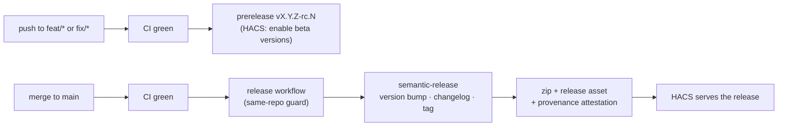

# Releases

Versioning is automated with **python-semantic-release** (PSR) driven by
Conventional Commits. The version is the single tag; `[tool.semantic_release]`
keeps both `pyproject.toml` (`version_toml`) and
`custom_components/climate_orchestrator/manifest.json` (`version_variables`) in
lock-step with it.

## Conventional commits drive the version

- `fix:` → patch
- `feat:` → minor
- `feat!:` / `BREAKING CHANGE:` → major
- Non-conventional commits (e.g. `chore:`, `docs:`) don't trigger a release.

## Branch-based prereleases

Prereleases are **branch-based** (PSR's native model — it releases from the
branch it runs on). `[tool.semantic_release.branches]` marks `main` as stable
and any `feat/*` or `fix/*` branch as prerelease (`prerelease_token = "rc"`):

- **Push to a `feat/*` / `fix/*` branch** (after CI is green) → an
  `X.Y.Z-rc.N` **prerelease**. Testers enable *Show beta versions* on the
  integration in HACS to install it.
- **Merge that branch into `main`** → the stable `X.Y.Z` release HACS serves
  by default.

Two consequences of feature-branch prereleases: PSR commits the version bump +
tag *onto the feature branch* (the `[skip ci]` in the commit message stops a
re-trigger loop), and the **version is PEP 440** (`rcN`), so the branch name
can't appear in it. One-time bootstrap: the then-current commit was tagged
`v0.11.0` so PSR continues from that baseline rather than recomputing from
zero.

## The release workflow

A single workflow, **`release.yml`**, handles both stable and prerelease. It is
triggered by a *successful* CI run of a **push** event on `main`, `feat/**`,
or `fix/**` (`workflow_run`), so a red commit is never tagged — and a
same-repo pull-request CI run (whose jobs are skipped as duplicates of the
push run) can never trigger a release before the push run's tests finish. It
checks out whichever branch CI ran on and runs PSR, which:

1. reads the branch config to decide stable vs prerelease,
2. bumps `pyproject.toml` + `manifest.json`,
3. updates `CHANGELOG.md` (changelog update mode — appends new entries rather
   than regenerating the file),
4. runs `build_command` to produce `dist/climate_orchestrator.zip` (the
   integration directory's contents, manifest at the zip root),
5. commits (`chore(release): … [skip ci]`), tags, and
6. publishes the GitHub Release with the zip attached
   (`[tool.semantic_release.publish]`).

The workflow then re-downloads the published asset and verifies the two
things HACS depends on — `manifest.json` at the zip root, with a `version`
matching the tag — so a packaging regression fails the release loudly instead
of surfacing as a broken install.

## Provenance and HACS consumption

- `actions/attest-build-provenance` records verifiable build provenance for
  the zip; verify with
  `gh attestation verify climate_orchestrator.zip -R <repo>`.
- HACS installs that exact asset: `hacs.json` sets `zip_release` plus
  `filename`, so HACS downloads the published `climate_orchestrator.zip` from
  the GitHub Release rather than cloning the repository tree.

Supply-chain hardening around the release job (SHA-pinned actions, zizmor, the
`head_repository == github.repository` guard) is covered in
[Tooling](tooling.md#supply-chain-notes).

Next: [Contributing](contributing.md) — dev setup and project conventions.
